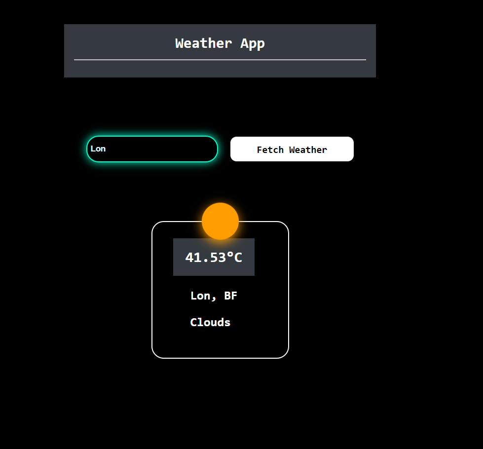

# Weather App

## Overview
The Weather App is a simple web application built using React that allows users to fetch real-time weather data for any location. Users can enter a city name, and the app will display the current temperature, weather conditions, and location details.

## Features
- Fetches real-time weather data using OpenWeatherMap API.
- User-friendly interface with a dark-themed design.
- Provides temperature, city name, and weather conditions.
- Dynamic weather icons based on conditions (Cloudy, Clear, Rain, Snow, Thunderstorm, etc.).
- Interactive UI with modern styling.

## Technologies Used
- **React.js** - Frontend framework.
- **CSS** - Styling with dark mode and modern UI elements.
- **JavaScript (ES6+)** - Logic and API fetching.
- **OpenWeatherMap API** - Used to fetch real-time weather data.

## Installation & Usage
### Prerequisites
- Node.js installed
- Internet connection for fetching weather data

### Steps to Run
1. Clone this repository:
   ```sh
   git clone https://github.com/yourusername/weather-app.git
   ```
2. Navigate to the project folder:
   ```sh
   cd weather-app
   ```
3. Install dependencies:
   ```sh
   npm install
   ```
4. Start the development server:
   ```sh
   npm start
   ```
5. Open `http://localhost:3000/` in your browser.
6. Enter a city name in the input field and click on "Fetch Weather".
7. View the temperature, location, and weather conditions.

## API Integration
This app uses the OpenWeatherMap API to fetch real-time data. Make sure to replace `api_key` in the `WeatherApp.js` file with a valid API key from OpenWeatherMap.

## Screenshots


## Future Improvements
- Add support for more weather parameters like humidity and wind speed.
- Implement geolocation to automatically fetch the user's current weather.
- Enhance UI with animations and more interactive elements.
- Convert temperature units between Celsius and Fahrenheit.

## License
This project is open-source and available under the MIT License.

## Author
- **Your Name** - Developer
- GitHub: [yourusername](https://github.com/yourusername)
- Email: your.email@example.com

